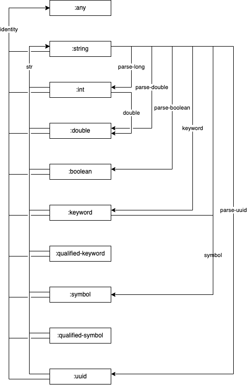

> # [_**Muotti**_](https://en.wiktionary.org/wiki/muotti)<br />
> _**Noun.**_
>
> 1. mould/mold (hollow form or matrix for shaping a fluid or plastic substance)
> 2. cast (mould used to make cast objects)
> 3. die
> 4. form (thing that gives shape to other things as in a mold)

<sup>(_source: https://en.wiktionary.org/wiki/muotti_)</sup>

[](https://github.com/esuomi/muotti/actions/workflows/deploy.yaml)
[](https://clojars.org/fi.polycode/muotti)
[](https://cljdoc.org/jump/release/fi.polycode/muotti)


Muotti is a graph based value transformer library which aims
to solve value transformation by utilizing a [digraph](https://en.wikipedia.org/wiki/Directed_graph) of known
transformations to produce a _transformer chain_ which is then used to perform the actual transformation.

# Usage

Given a map of adjacencies - that is, edges of a graph - with validation and transformer functions:
```clojure
(require '[muotti.core :as muotti])

(def config {:transformations {[:keyword :string] {:validator   keyword?
                                                   :transformer name}
                               [:string :number]  {:validator   string?
                                                   :transformer parse-long}
                               [:string :boolean] {:validator   string?
                                                   :transformer boolean}
                               [:number :string]  {:validator   number?
                                                   :transformer str}}})
```

a transformer can be created:
```clojure
(def t (muotti/->transformer config))
```

which is then immediately usable for transforming values:
```clojure
(muotti/transform t :keyword :number :123)
; => 123
(muotti/transform t :number :keyword 123)
; => :123
```

Unresolvable transformations return a special value:
```clojure
(muotti/transform t :keyword :double :3.14)
; => ::unknown-path
```

Transformer chain validation errors also return a special value:
```clojure
(def broken-adjacency {[:a :b] {:validator   keyword?
                                :transformer str}})
(def t2 (muotti/->transformer broken-adjacency))
(muotti/transform t2 :a :b "not a number")
;; => ::invalid-value
```

## [Malli](https://github.com/metosin/malli) integration

Muotti is made to complement Malli's decoding and encoding capabilities through [Malli's Value Transformation](https://github.com/metosin/malli#value-transformation)
capability.

Create a Malli transformer and then use it to call eg. `malli.core/decode` with the transformer:
```clojure
(require '[muotti.malli :as mm])

(malli/decode
  [:map
   [:a {:muotti/ignore true} :uuid]
   [:b :int]]
  {:a :invalid
   :b "123"}
  (mm/transformer (muotti/->transformer mm/malli-config)))
;;=> {:a nil, :b 123}
```

### Supported transformations

The following transformations are pre-defined in the `muotti.malli/malli-config`.



## TODO

 - [ ] `:muotti/default` - allow Malli transformer to inject a default value for `nil` values
